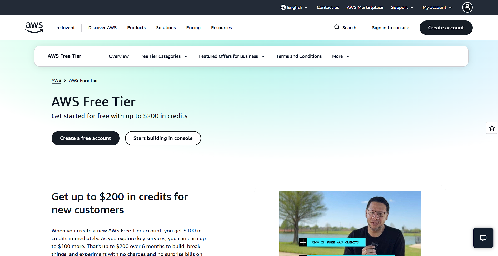

# AWS Research

## Brief Overview
Amazon Web Services (AWS) is the cloud computing platform launched by Amazon in 2006. It is the largest and most mature public cloud provider, offering over 200 fully featured services from data centers globally.

## Global Infrastructure
AWS infrastructure is organized into **Regions** (geographically separate areas) and **Availability Zones** (isolated data centers within a region), plus a global network of Edge Locations for content delivery via CloudFront.

## Cloud Management Console
The **AWS Management Console** is a web-based interface for provisioning and monitoring services, alongside the AWS CLI and SDKs for programmatic access.

## Four (4) Core Services
1. **Amazon EC2** – resizable virtual machine compute capacity.
2. **Amazon S3** – object storage for any amount of data.
3. **Amazon RDS** – managed relational database service.
4. **AWS IAM** – identity and access management for users and permissions.

## Three (3) Advantages
1. Largest service catalog and market share, meaning extensive documentation and community support.
2. Mature, granular pricing and cost-management tools (pay-as-you-go).
3. Strong global infrastructure footprint with many regions and availability zones.

## Typical Enterprise Use Cases
- Hosting scalable web and mobile application backends.
- Big data analytics and data lakes.
- Enterprise workload migration and disaster recovery.

