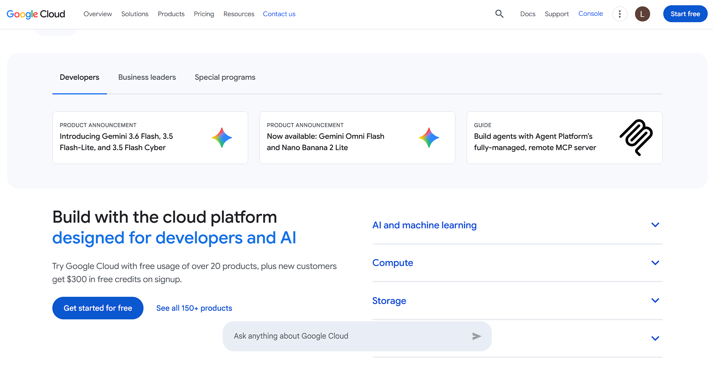

# Google Cloud Platform (GCP) Research

## Brief Overview
Google Cloud Platform is Google's suite of cloud computing services, built on the same infrastructure Google uses for its own products. It is known for strength in data analytics, AI/ML, and container orchestration.

## Global Infrastructure
GCP infrastructure is organized into **Regions** and **Zones**, connected by Google's private global network and content delivery through Google's edge points of presence.

## Cloud Management Console
The **Google Cloud Console** is the web-based management interface, alongside the `gcloud` CLI and Cloud SDK for automation.

## Four (4) Core Services
1. **Compute Engine** – customizable virtual machines.
2. **Cloud Storage** – object storage service.
3. **Cloud SQL** – managed relational database service.
4. **Cloud IAM** – identity and access management.

## Three (3) Advantages
1. Industry-leading AI/ML tools (Vertex AI) built on Google's own research.
2. Google Kubernetes Engine (GKE) is considered the most mature managed Kubernetes offering, since Google created Kubernetes.
3. Strong data analytics stack (BigQuery) for large-scale data warehousing.

## Typical Enterprise Use Cases
- Data analytics and machine learning pipelines.
- Container-native and Kubernetes-based application deployment.
- Global-scale applications needing Google's private backbone network.

