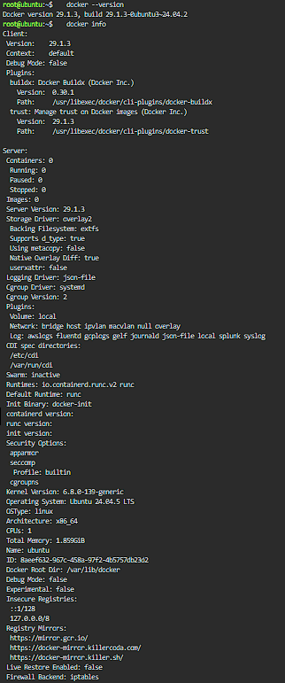
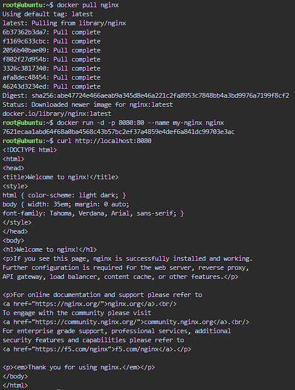
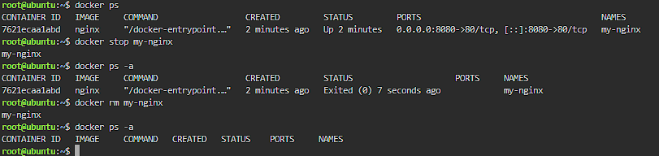

# Docker Deployment: Nginx

## Environment

Ubuntu terminal (prompt shows `root@ubuntu`), logged in as root. Docker version: shown in the first screenshot below.

## Deployment Commands

| Command | What it did |
|---|---|
| `docker pull nginx` | Downloaded the latest Nginx image from Docker Hub to the machine. |
| `docker run -d -p 8080:80 --name my-nginx nginx` | Started a container from the Nginx image. `-d` runs it in the background, `-p 8080:80` maps port 8080 on the host to port 80 in the container, and `--name my-nginx` names the container. |
| `curl http://localhost:8080` | Sent a request to port 8080 to check that Nginx is running. It returned the default "Welcome to nginx!" page. |

## Container Lifecycle Commands

| Command | What it did |
|---|---|
| `docker ps` | Listed the running containers. `my-nginx` showed as `Up 2 minutes`, with port `8080` mapped to port `80`. |
| `docker stop my-nginx` | Stopped the running container. It printed the name `my-nginx` to confirm. |
| `docker ps -a` | Listed all containers, including stopped ones. `my-nginx` now showed `Exited (0)`, which means it stopped cleanly. |
| `docker rm my-nginx` | Deleted the stopped container. It printed the name `my-nginx` to confirm. |

After `docker rm`, running `docker ps -a` again showed an empty list, so the container was fully removed.

## Screenshots

**Docker version**

**Nginx running**

**Container lifecycle (stop and remove)**

